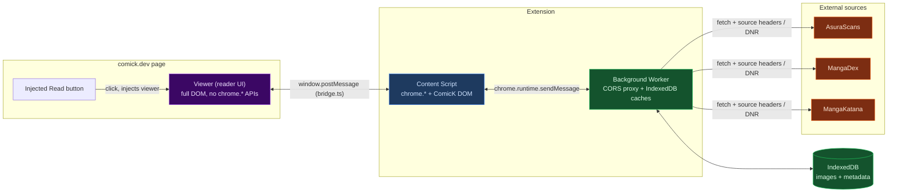
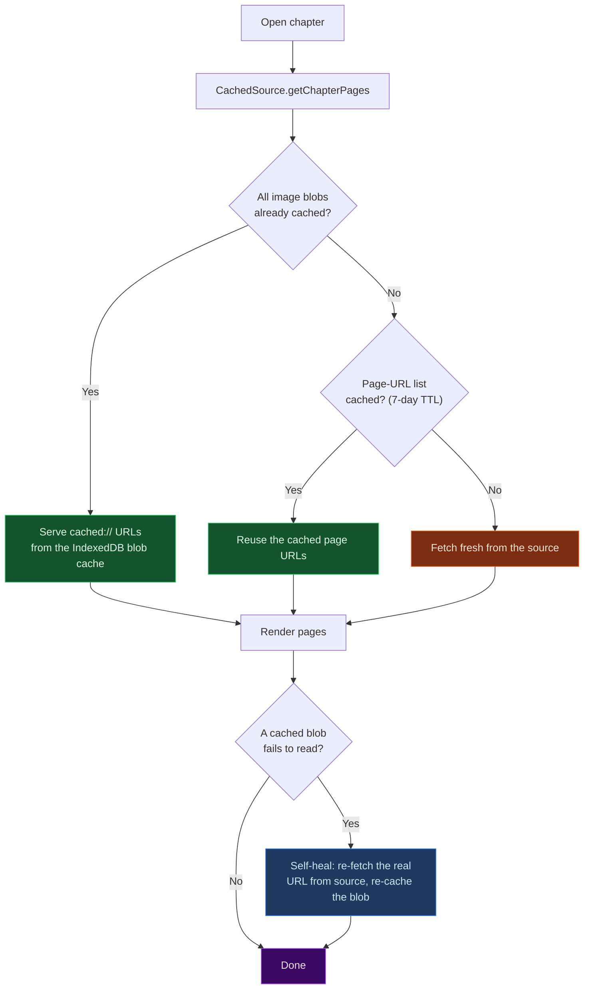

<h1 align="center">ComicK Revive</h1>

<p align="center">
  A full manga reading app that lives in your browser.<br/>
  Born when <a href="https://comick.dev">ComicK</a> dropped its built-in reader, it now reads from 70+ sources<br/>
  with its own library, history, and stats, on comick.dev pages or fully standalone.
</p>

<p align="center">
  
  
  
  
  
  
</p>

<p align="center">
  <a href="#-news">News</a> &nbsp;·&nbsp;
  <a href="#-features">Features</a> &nbsp;·&nbsp;
  <a href="#-supported-sources">Sources</a> &nbsp;·&nbsp;
  <a href="#-installation">Install</a> &nbsp;·&nbsp;
  <a href="#-usage">Usage</a> &nbsp;·&nbsp;
  <a href="#%EF%B8%8F-architecture">Architecture</a> &nbsp;·&nbsp;
  <a href="#%EF%B8%8F-known-issues">Known issues</a>
</p>

<br/>

> [!WARNING]
> **Beta (0.3.0).** The core reading experience is solid, but a few things are still
> rough or experimental. Read [Known issues](#%EF%B8%8F-known-issues) first. It runs on
> Chromium browsers only and is loaded unpacked, since it isn't on the Chrome Web Store.

<br/>

## 📰 News

- **[v0.3.0](../../releases/tag/v0.3.0)** · *2026-07-12* · **The sources update**<br/>
  A catalog of **70+ sources** you can switch on in one click, an **18+ toggle**, and a one-button **Test all** with a shareable report. Plus a full **Library** with detail pages, a **History** tab, and a much smoother search.

- **[v0.2.0](../../releases/tag/v0.2.0)** · *2026-07-04* · **From reader to app**<br/>
  The **dashboard** and toolbar popup arrive: library, read-from-search, stats, add-your-own JSON sources with AI help, backup **export/import**, and update checks.

- **[v0.1.0](../../releases/tag/v0.1.0)** · *2026-06-26* · **First public beta**<br/>
  The in-page reader for comick.dev: three sources, offline caching, three reading modes, and exact-position resume.

<sub>Full notes for every version live on the [**Releases**](../../releases) page.</sub>

<br/>

## ✨ Features

#### 📖 Reading
- Three modes: vertical webtoon scroll, single page, and double-page spreads (read right to left). Switch anytime.
- Zoom and image-fit controls, full keyboard navigation, and smooth scrolling you can tune.
- Keeps your exact spot by anchoring to an image rather than a scroll position, so resizing, zooming, or switching modes never loses your place.

#### 🔌 Sources
- Reads from **AsuraScans, MangaDex, and MangaKatana** out of the box.
- A built-in **source catalog with 70+ sites** (Madara-engine scanlators and aggregators, each with its real icon). Enabling one asks for permission to that site only; the extension never gets blanket host access. A one-click **Test all** checks every catalog site end to end (search → chapters → pages → image) with a live pass/fail bar and a copyable report.
- **Add your own sources without touching code.** A source is a small JSON "recipe" the extension runs at load time. Import one by paste, file, or URL, and there's a one-click prompt that lets an AI write the recipe for you, plus a built-in test tool that checks it against the live site.
- Set source **priority** by dragging, enable or disable any source, and point a source at a new domain when a site moves.
- Link a ComicK title to a source once and it's remembered. A fuzzy search helps you find the right match. AsuraScans' shuffled image tiles are unscrambled automatically.

#### 🖥️ Dashboard & popup
- A full **dashboard** page (click the toolbar icon → *Open dashboard*) with your library, reading history, a cross-source **search** you can read from directly (no ComicK page needed), stats, settings, and source management.
- A **popup** on the toolbar icon with your recently read titles and quick stats, one click back into a chapter.
- Search any of your sources and start reading right inside the dashboard.

#### 📊 Stats, backup & updates
- **Reading stats:** chapters read, active reading time, daily activity chart, and streaks.
- **Backup and restore** your reading history, library, sources, and settings to a single file, with merge or replace on import. Cached images are left out to keep it small.
- The dashboard **checks for new releases** and tells you when an update is out.

#### 📂 Library & offline
- Tracks read/unread per source and per chapter, and the *Continue* button picks up at the exact page and scroll position where you left off, not just the start of the chapter.
- Caches pages and chapter data locally, so anything you've opened before loads instantly and works with no connection.
- You set the cache size limit and how it clears old data, and a per-manga cache manager lets you see and prune what's stored.

#### 🧩 Inside ComicK
- *Start Reading* and *Continue* buttons are injected straight onto ComicK's pages. No new tab, no separate app.
- A settings panel for background color, image fit, scroll speed, and toolbar auto-hide.

<br/>

## 📚 Supported sources

| Source | Status | How it's fetched |
|--------|:------:|------------------|
| **AsuraScans** | ✅ Default | JSON API plus Astro pages. Handles rotating slugs and scrambled tiles. |
| **MangaDex** | ✅ | Official REST API and the MD@Home image CDN (English). |
| **MangaKatana** | ✅ | HTML scraping. Sensitive to Cloudflare, so retry if a search comes back empty. |
| **Catalog (70+ sites)** | ✅ Opt-in | Dashboard → Sources → *Browse catalog*. Madara-engine sites, validated end to end; each one asks for its own site permission when you enable it. 18+ entries stay hidden behind a toggle. |
| *Your own* | ➕ Add-your-own | Import a JSON source recipe from the dashboard, no rebuild needed. |

> A few catalog sites sit behind bot checks or regional blocks; their status chip says so honestly instead of pretending. Availability can differ by country and network; the built-in **Test all** shows you exactly what works from yours. For a bundled TypeScript source, see [Adding a new source](#-adding-a-new-source).

<br/>

## 🚀 Installation

ComicK Revive is a Manifest V3 extension for Chromium browsers (Chrome, Edge, Brave). It isn't on the Chrome Web Store, so you load it unpacked.

### Pre-built (easiest)

1. Grab `comick-revive-v0.3.0.zip` from the [**Releases**](../../releases) page.
2. Unzip it somewhere.
3. Open `chrome://extensions` and turn on **Developer mode** (top right).
4. Click **Load unpacked** and pick the unzipped folder.
5. Head to [comick.dev](https://comick.dev), open a manga, and hit the **Read** button.

### Build from source

You'll need [Node.js](https://nodejs.org) 18+ and npm.

```bash
git clone https://github.com/BrAtUkA/ComicK-Revive.git
cd ComicK-Revive
npm install
npm run build        # production build into dist/
```

Load the `dist/` folder with **Load unpacked**, same as above. Reload the extension after each rebuild.

| Command | What it does |
|---------|--------------|
| `npm run build` | Type-checks and builds into `dist/` (debug logs stripped) |
| `npm run dev` | Watch build that keeps debug logs |
| `npm run package` | Builds, then zips `dist/` into `release/comick-revive-v<version>.zip` |

> Production builds drop `console.log`/`info`/`debug` on their own. `warn` and `error` stay. Pass `DEBUG=1` to any build if you want all of it.

<br/>

## 🎮 Usage

1. Open a manga or chapter on **comick.dev**.
2. Click **Start Reading**, or **Continue Ch. N** if you've read some already.
3. The first time you open a title, pick the matching manga on a source. That choice is saved.
4. Read. Position, mode, and progress all save themselves.

### Keyboard shortcuts

| Key | Action | | Key | Action |
|-----|--------|---|-----|--------|
| `W` / `↑` | Previous page | | `1` / `2` / `3` | Vertical / Single / Double mode |
| `S` / `↓` | Next page | | `+` / `-` / `0` | Zoom in / out / reset |
| `A` / `←` | Previous chapter | | `Space` / `Shift`+`Space` | Scroll down / up |
| `D` / `→` | Next chapter | | `Home` | Scroll to top |
| `F` | Fullscreen | | `G` | Settings |
| `T` | Toggle toolbar | | `Esc` | Close reader |

<br/>

## 🏗️ Architecture

The extension lives in three separate worlds that can't see each other's globals, so code written for one will break in another. A small message bridge connects them, and every outside request goes through the background worker to get around CORS.



| Context | Entry | Has `chrome.*` | Has DOM | Role |
|---------|-------|:--------------:|:-------:|------|
| **Content script** | `src/content/index.ts` | ✅ | ComicK DOM | Detect pages, inject buttons, relay the bridge |
| **Background worker** | `src/background/index.ts` | ✅ | ❌ | CORS proxy, IndexedDB image and data caches |
| **Viewer** | `src/viewer/index.ts` | ❌ | ✅ | The reader overlay; goes through the bridge for everything |

### How a chapter loads

Every source sits behind a caching layer that checks the cache before it ever touches the network, and patches itself if a cached image goes missing.



<br/>

## 🧰 Tech stack

| Layer | Technology |
|-------|-----------|
| Platform | Chrome Manifest V3 (service worker, content script, declarativeNetRequest) |
| Language | TypeScript 5 |
| Build | [Vite](https://vitejs.dev) 5, three self-contained entry points with no shared chunks |
| UI | Vanilla DOM, no framework. Classes with co-located CSS |
| Storage | `chrome.storage.local` plus IndexedDB (image blobs and source metadata) |
| Icons | [Lucide](https://lucide.dev) |

<br/>

## 🗂️ Project structure

```
ComicK-Revive/
├── src/
│   ├── background/      # Service worker: CORS proxy + IndexedDB caches
│   ├── content/         # Content script: page detection, button injection, bridge relay
│   ├── viewer/          # Reader UI (runs in page context)
│   │   ├── readers/     # Vertical / Single / Double page readers (+ continuous reading)
│   │   └── components/  # Source-link modal, chapter picker, settings, cache manager, ...
│   ├── dashboard/       # Dashboard page: library, history, search, stats, sources, settings
│   ├── popup/           # Toolbar popup: recent reads + quick stats
│   ├── sources/         # MangaSource impls + CachedSource wrapper + registry
│   │   ├── engines/     # Theme engines (Madara): one implementation drives many sites
│   │   ├── catalog/     # Built-in source catalog presets (pure data, one line per site)
│   │   └── spec/        # JSON source-spec format + interpreter (user-added sources)
│   ├── core/            # Storage, Settings, ReadingState, SourceMapping, Library, History, caches
│   ├── utils/           # bridge, imageLoader, fuzzy-match, keyboard, smooth-scroll, ...
│   ├── shared/          # Code shared across contexts (covers, backup, bot-wall detection, ...)
│   └── types/           # Shared TypeScript types + defaults
├── specs/               # Example JSON source specs (MangaPill, WeebCentral)
├── doc/                 # Guides (adding sources)
├── rules/               # declarativeNetRequest header rules
├── assets/icons/        # Extension icons + bundled catalog source icons
├── scripts/             # Release zip + catalog tooling (live-site probe, preset/icon harvesters)
├── manifest.json        # MV3 manifest
└── vite.config.ts       # One build entry per execution context
```

<br/>

## 🧩 Adding a new source

Three ways, easiest first; the full guide with the spec format reference lives in **[doc/adding-sources.md](doc/adding-sources.md)**.

1. **Source catalog** (one click). Dashboard → Sources → **Browse catalog**: 70+ built-in sites, each asking for its own site permission when enabled. **Test all** verifies every site end to end from your network.
2. **JSON source spec** (no rebuild). Teach the reader a new site with a single JSON file: Dashboard → Sources → **Add source**. A built-in prompt lets an AI write the spec for you, and the test tool checks it step by step against the live site. Start from the working examples: [`specs/mangapill.json`](specs/mangapill.json) (clean starter) and [`specs/weebcentral.json`](specs/weebcentral.json) (advanced: offset pagination, scoped selector chains, fallbacks).
3. **Built-in TypeScript source** (contributors). Implement `MangaSource` (`src/sources/Source.interface.ts`), register it in `src/sources/index.ts`, add the site to `host_permissions`. If the site runs the Madara WordPress theme, skip the code: it's a one-line preset in `src/sources/catalog/presets.ts`.

The Kotlin implementations in the Tachiyomi / keiyoushi ecosystem remain the best reference for how each site behaves.

<br/>

## ⚠️ Known issues

This is a `0.3.0` beta, so expect rough edges. Sources can also break when a site changes its markup or moves domains. If a title stops loading, try the chapter **refresh** button or re-link the source.

- **Continuous reading** (scrolling straight from one chapter into the next) is **experimental and off by default**. It can break when you resume a session, so turn it on in settings only if you want to try it.
- The **page counter** sometimes freezes during fast navigation.
- **Single and double-page** modes aren't as polished as vertical scroll yet.
- **MangaKatana** sits behind Cloudflare, so an empty search result usually just means "try again in a moment".
- Chromium browsers only. No Firefox.

<br/>

## 🙏 Acknowledgements

- [**ComicK**](https://comick.dev), the site this builds on.
- The **Tachiyomi / [keiyoushi](https://github.com/keiyoushi/extensions-source)** extensions (Apache-2.0). The source-parsing logic is based on their Kotlin implementations.
- [**Lucide**](https://lucide.dev) for the icons.

<br/>

## 📄 License & disclaimer

Licensed under the **[PolyForm Noncommercial License 1.0.0](LICENSE.md)**. Free for any noncommercial use; commercial use isn't allowed.

Please also read the [**DISCLAIMER**](DISCLAIMER.md). ComicK Revive is an unofficial fan project. It isn't affiliated with any of the sites it talks to, it hosts none of its own content, and it's meant for personal use. Following each source's Terms of Service and your local copyright law is on you.

<br/>

<p align="center">
  <a href="https://github.com/BrAtUkA">
    
  </a>
</p>
